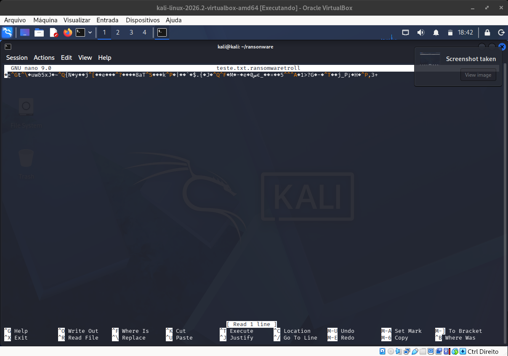
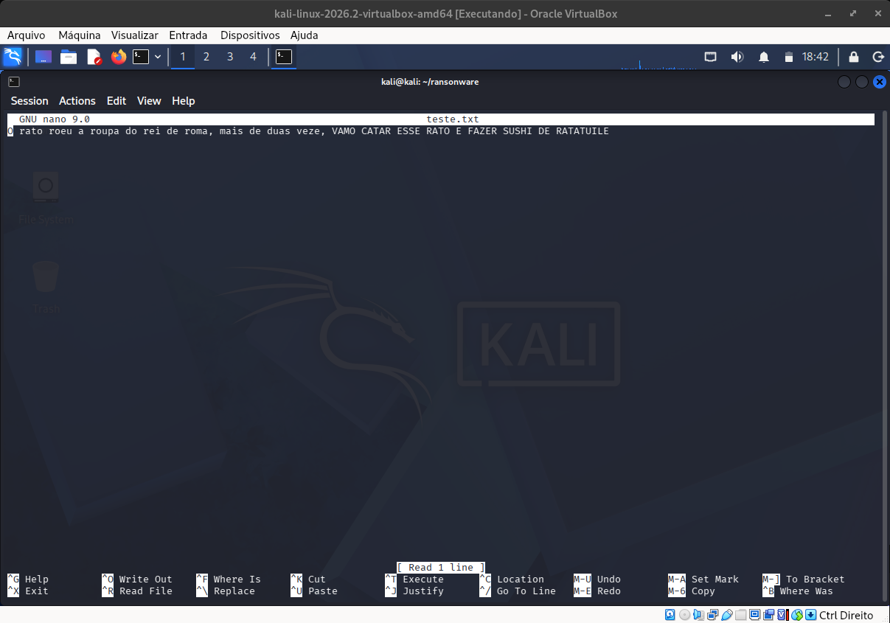

# 🔒 Ransomware Educacional - Projeto Final DIO

Este repositório contém a implementação prática do projeto de Ransomware para o Bootcamp de Cibersegurança da [DIO](https://www.dio.me/). O objetivo é demonstrar, de forma prática e em ambiente controlado, os conceitos de criptografia e descriptografia de arquivos utilizando a linguagem Python.

> **⚠️ AVISO LEGAL:** Este projeto foi desenvolvido com fins estritamente educacionais e de conscientização em segurança da informação. O uso deste código em sistemas ou redes sem autorização prévia é ilegal. Não utilize para fins maliciosos.

## 💻 Tecnologias Utilizadas
* **Python 3**
* **pyaes**: Biblioteca responsável por aplicar a criptografia AES (Advanced Encryption Standard).

## ⚙️ Como funciona a simulação
A dinâmica do projeto ocorre através de dois scripts principais:

1. **`encrypter.py` (O Ataque):** Lê o conteúdo do arquivo de teste alvo, aplica a criptografia usando uma chave AES de 16 bytes, remove o arquivo original e gera um novo arquivo inacessível com a extensão modificada (ex: `.ransomwaretroll`).
2. **`decrypter.py` (O Resgate):** Utiliza a mesma chave simétrica (chave de resgate) para ler o arquivo criptografado, decodificar os dados e recriar o arquivo original intacto, removendo a versão bloqueada.

## 📸 Demonstração do Projeto

Abaixo é possível visualizar o comportamento dos arquivos antes e depois da execução dos scripts:

### 1. Arquivo Criptografado
Após a execução do script `encrypter.py`, o arquivo original é bloqueado. Tentativas de leitura resultarão em caracteres ilegíveis.


### 2. Arquivo Descriptografado e Restaurado
Após o "pagamento do resgate" e a execução do `decrypter.py` com a chave correta, o arquivo original retorna ao seu estado normal.


## 🚀 Como testar na sua máquina

### Pré-requisitos
Certifique-se de ter o Python 3 instalado em seu computador. Em seguida, instale a dependência de criptografia:
```bash
pip install pyaes
